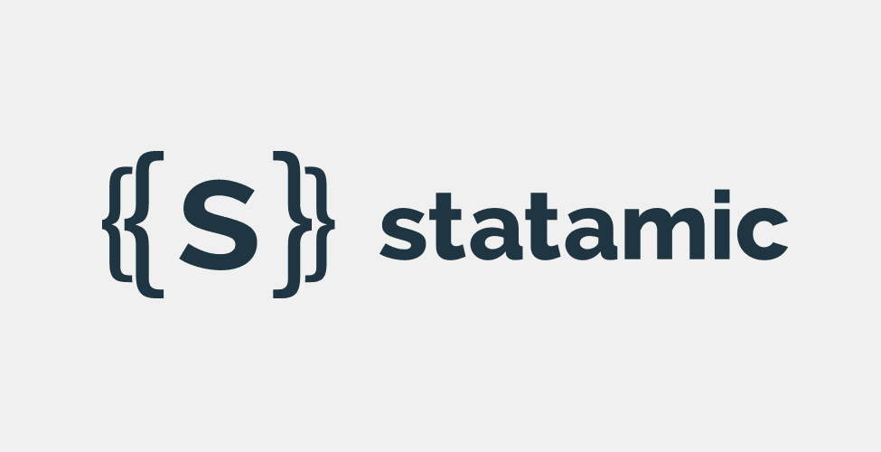

# Statamic v2 Mobile Detect Addon

 + 

This plugin could not exist without the amazing work of the [Mobile Detect project](https://github.com/serbanghita/Mobile-Detect) 

## Installing via git

**Note:** It's assumed you're located in `/path/to/document/root` and all of your folders are located in the document root (and not one level above).

Step 1. Clone the repo via git into `/site/addons/`.

```bash
cd /path/to/document/root
git clone git@github.com:haikulab/statamic2-mobile-detect.git ./site/addons/MobileDetect
```

Step 2. Install dependencies via the Statamic `please` tool (part of the source)

```bash
php please addon:refresh
```

You should see something like this:

```
$ php please addon:refresh
Adding packages: haikulab/mobile-detect
Please wait while dependencies are updated via Composer. This may take a while.
Dependencies updated!
```

Step 3. Clear the Statamic using `Please` tool

```bash
php please cache:clear
```

Step 4. Use the tags listed in **Usage**.

## Usage

### Core Tag

```bash
{{ mobile_detect }}
```

### Example Output for `{{ mobile_detect }}`

+ `computer`
+ `tablet`
+ `phone`

### Get `Mobile Detect` library version number

```bash
{{ mobile_detect:library_version }}
```

### Example Output for `{{ mobile_detect:library_version }}`

```bash
2.8.19
```

## Using as part of logic

Using `{{ mobile_detect }}` as part of an `{{ if }}` statement:

```bash
{{if something == { mobile_detect } }}
    ...
    {# some content #}
    ...
{{ endif }}
```

## Tested on

+ 

## Disclaimer

I've 'written' this plugin for my own use. It comes without any guarantee, so your mileage may vary in using it. If you find bugs or have great additions you'd like to share, use github to fork the project and share your improvements by initiating pull request

### MIT License

Copyright (c) 2015 Sergei Filippov

Permission is hereby granted, free of charge, to any person obtaining a copy of this software and associated documentation files (the "Software"), to deal in the Software without restriction, including without limitation the rights to use, copy, modify, merge, publish, distribute, sublicense, and/or sell copies of the Software, and to permit persons to whom the Software is furnished to do so, subject to the following conditions:

The above copyright notice and this permission notice shall be included in all copies or substantial portions of the Software.

THE SOFTWARE IS PROVIDED "AS IS", WITHOUT WARRANTY OF ANY KIND, EXPRESS OR IMPLIED, INCLUDING BUT NOT LIMITED TO THE WARRANTIES OF MERCHANTABILITY, FITNESS FOR A PARTICULAR PURPOSE AND NONINFRINGEMENT. IN NO EVENT SHALL THE AUTHORS OR COPYRIGHT HOLDERS BE LIABLE FOR ANY CLAIM, DAMAGES OR OTHER LIABILITY, WHETHER IN AN ACTION OF CONTRACT, TORT OR OTHERWISE, ARISING FROM, OUT OF OR IN CONNECTION WITH THE SOFTWARE OR THE USE OR OTHER DEALINGS IN THE SOFTWARE.
